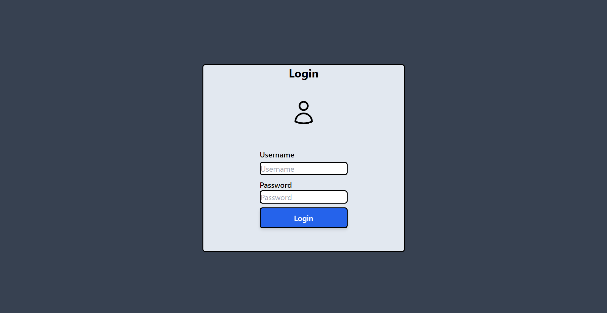
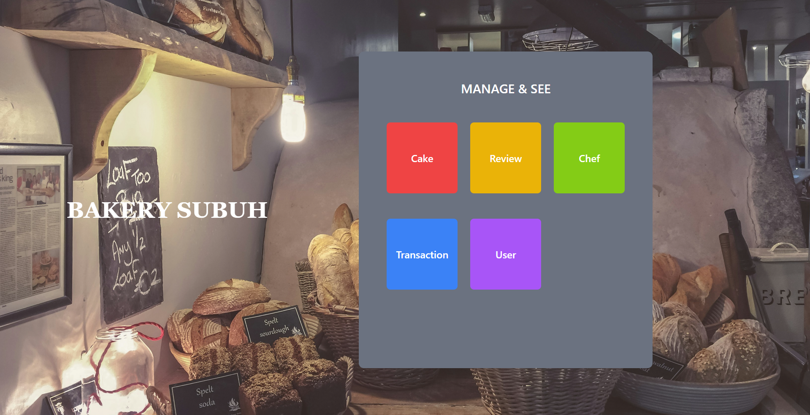
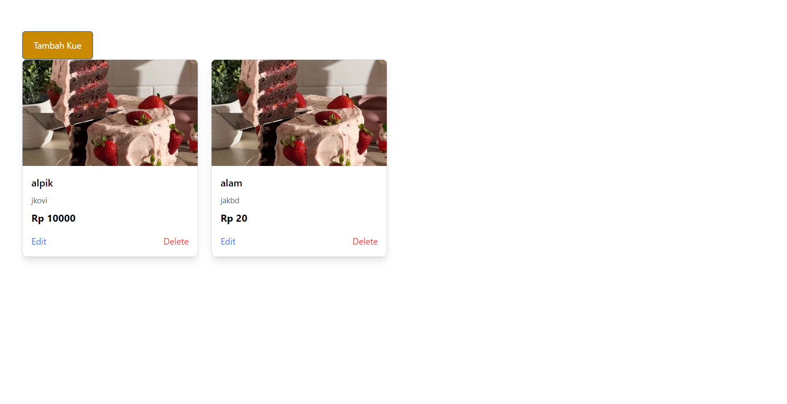
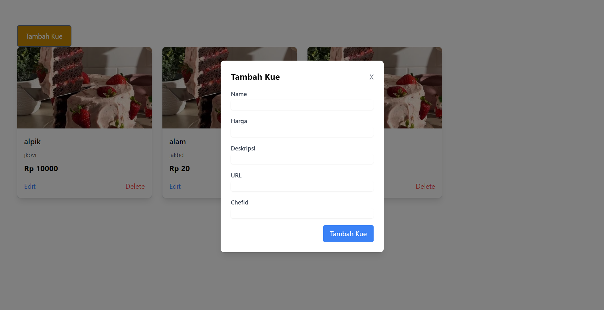

# Proyek Front-End dengan React dan Express
- Deskripsi Proyek
Proyek ini merupakan aplikasi web yang dibangun menggunakan React JS di bagian front-end dan Express JS di bagian back-end. Aplikasi ini menggunakan React Router DOM untuk mengatur navigasi antar halaman dan Axios untuk melakukan pengambilan (fetching) data dari API. Untuk styling, proyek ini memanfaatkan Tailwind CSS. Bagian back-end berjalan dengan menggunakan Nodemon untuk secara otomatis memantau perubahan pada kode.

# Fitur Utama
- React JS sebagai library front-end untuk membangun user interface yang dinamis.
- Express JS untuk membuat API back-end yang melayani permintaan dari aplikasi front-end.
- React Router DOM untuk navigasi antar halaman tanpa perlu reload halaman.
- Axios untuk melakukan HTTP request seperti GET, POST, PUT, DELETE untuk mengambil dan mengirim data ke server.
- Tailwind CSS untuk membuat tampilan yang modern dan responsif dengan utility-first CSS.
- Nodemon untuk secara otomatis memonitor perubahan pada server dan menjalankan ulang server Express.

# Preview

- ### Halaman Login

- ### Halaman Home

- ### Halaman Cake

- ### Form Add Cake
